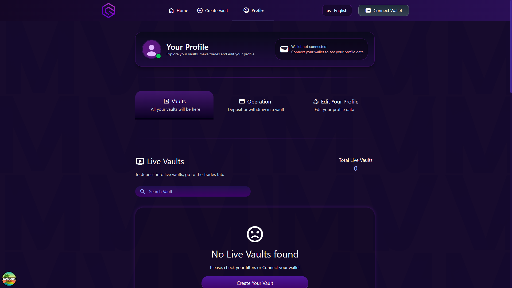

# ⚡ Metavault

A decentralized Web3 platform for creating on-chain vaults, executing trades, and managing your portfolio — with the look and feel of a real exchange.

---

### Overview

A clean, exchange-style interface for managing on-chain vaults and trades. Includes a full landing page, account creation, and real-time vault monitoring — built to feel like a simplified decentralized exchange rather than a typical Web3 demo.

**Core features:**

- Landing page with full product overview
- User account creation and profile management
- Create and manage on-chain vaults
- Execute trades directly on-chain
- Monitor active and completed vaults in real time
- Multi-language support
- Clean, minimal exchange-inspired UI

---

### Screenshots

---

### Stack

| Layer          | Technologies                                            |
| -------------- | ------------------------------------------------------- |
| **Frontend**   | React · TanStack · Tailwind CSS · React Hook Form · Zod |
| **Web3**       | Wagmi · Viem                                            |
| **i18n**       | i18next                                                 |
| **Database**   | Neon (PostgreSQL)                                       |
| **Deployment** | Vercel                                                  |

---

Built for educational and portfolio purposes · 3 months of development.
